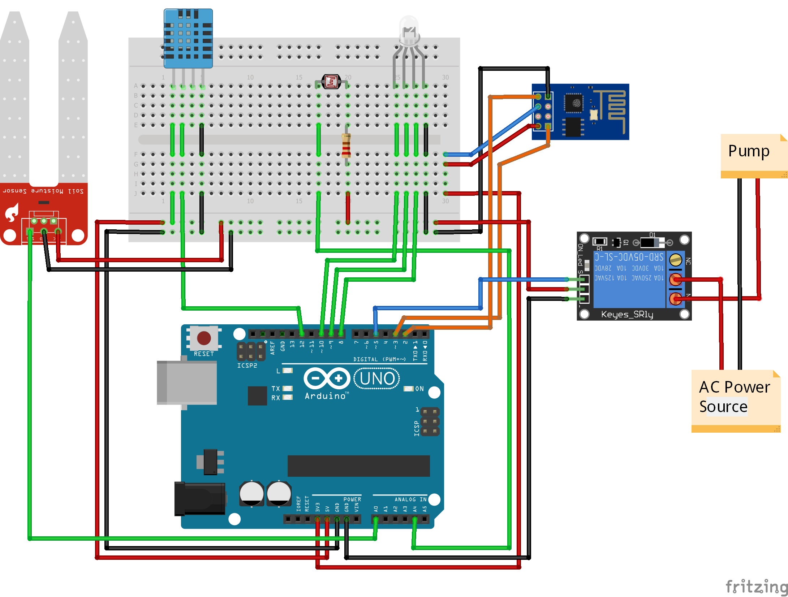
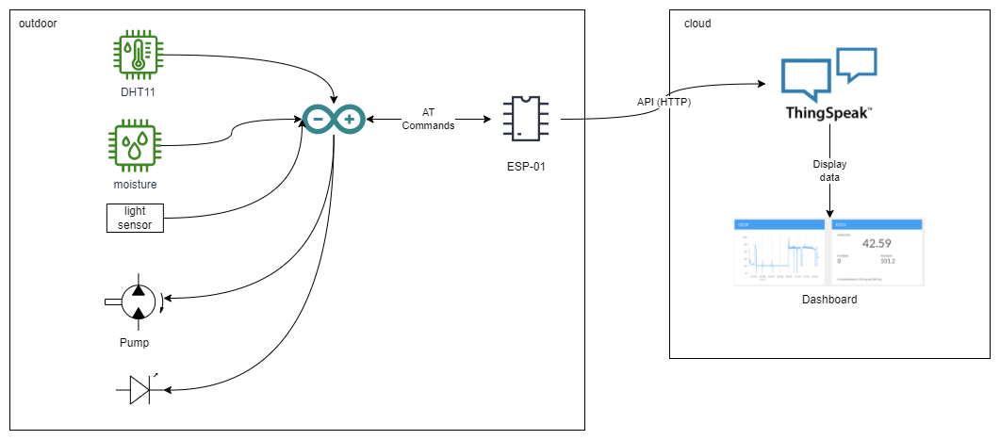
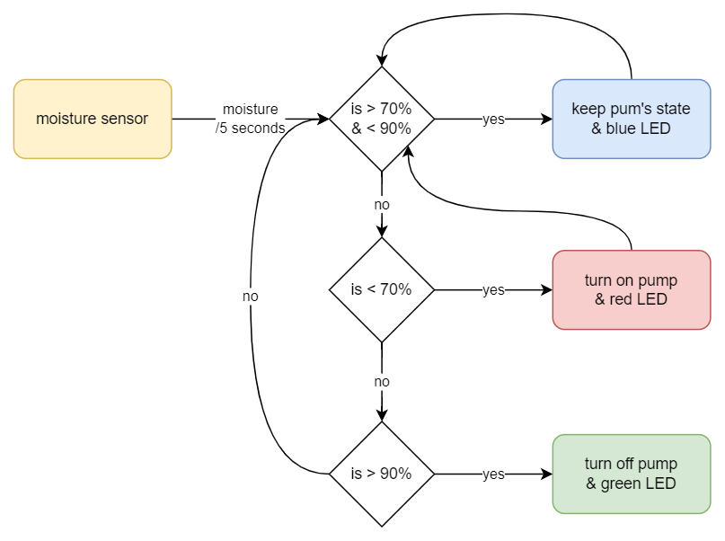

# Smart Gardening using Arduino Uno

A class project based on Arduino Uno.

Course Code: `ECE341`

## Circuit Diagram

## Components

| name | type | purpose |
|------|------|---------|
| `Arduino Uno` | microcontroller | controls the sensors and actuators |
| `ESP-01` | wireless module | connects to the internet |
| `soil moisture sensor` | analog sensor | measures the moisture of the soil |
| `LDR` | analog sensor | measures the light intensity |
| `DHT11` | digital sensor | measures the temperature and humidity of the air |
| `relay` | digital actuator | controls the watering system |
| `water pump` | analog actuator | water pump |
| `LED` | digital actuator | LED |

## Architecture

## Working

## Team

    <a href="https://github.com/tasnimzotder">
        
        &nbsp&nbsp&nbsp&nbsp
    </a>
    <a href="https://github.com/kumarsohan524">
        
        &nbsp&nbsp&nbsp&nbsp
    </a>
    <a href="https://github.com/Eshika234">
        
        &nbsp&nbsp&nbsp&nbsp
    </a>

## License

This project is licensed under the [MIT license](LICENSE).
